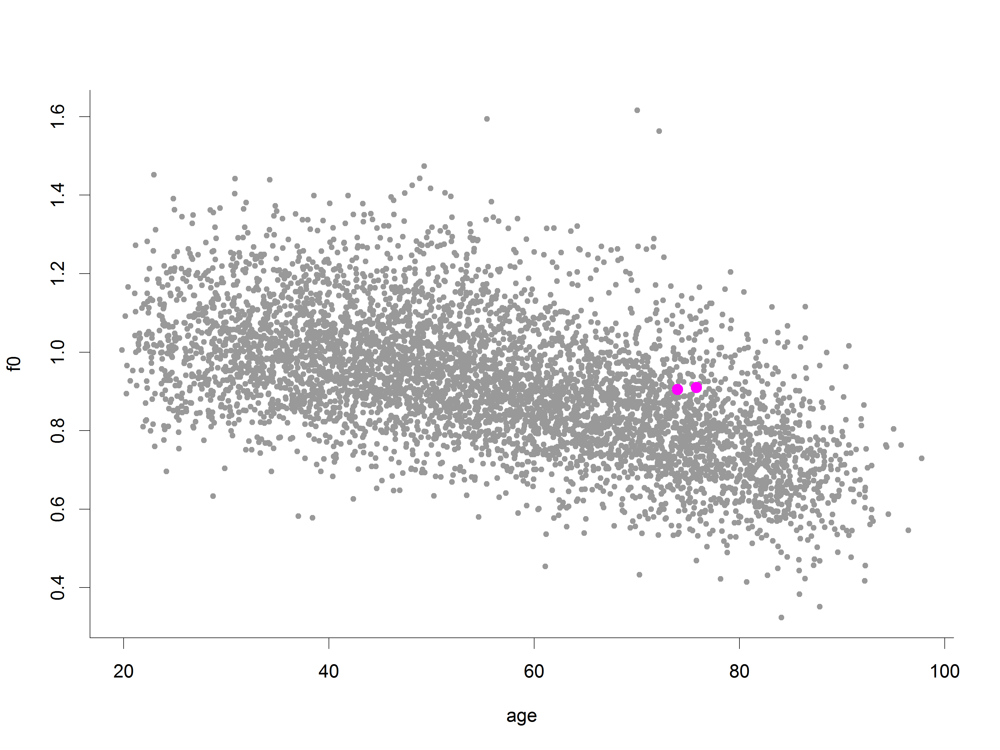
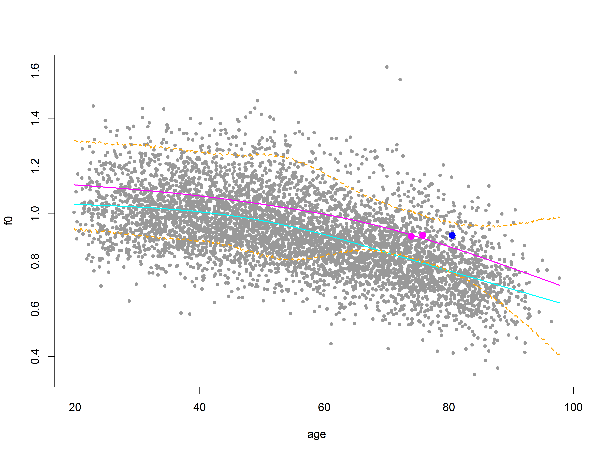
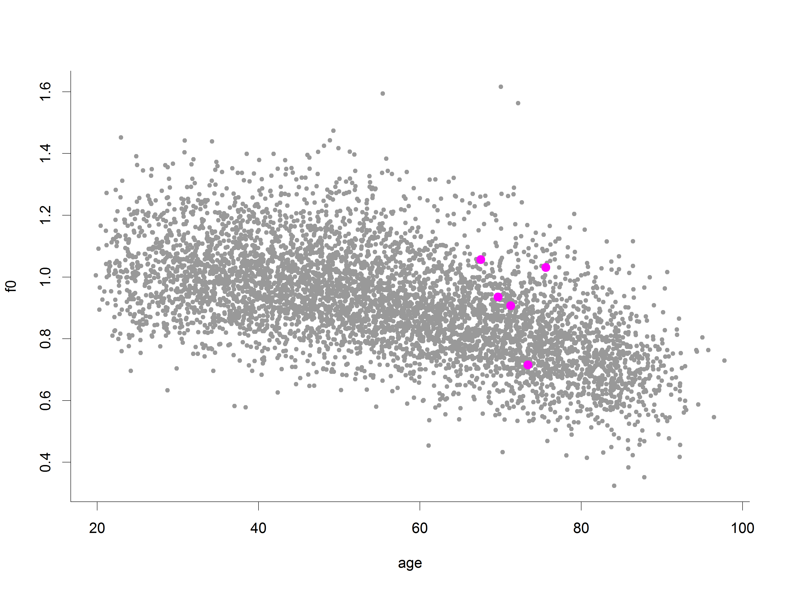
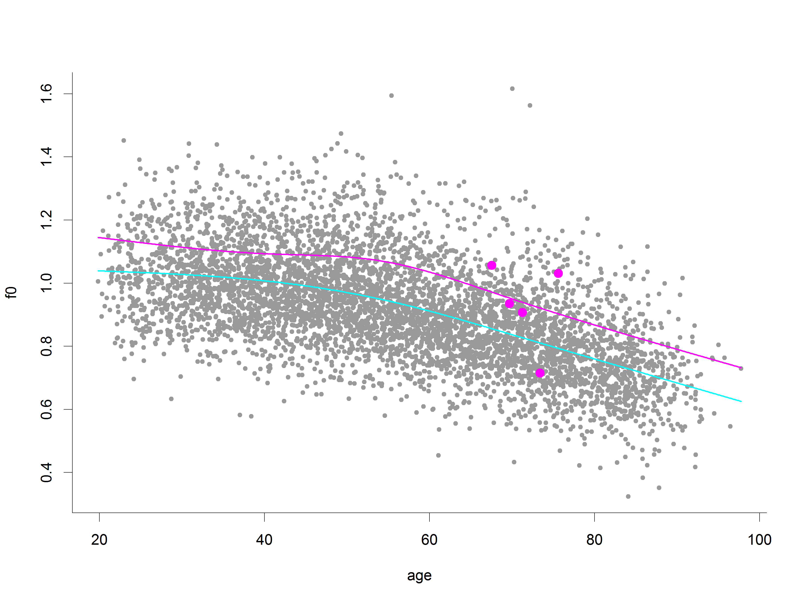
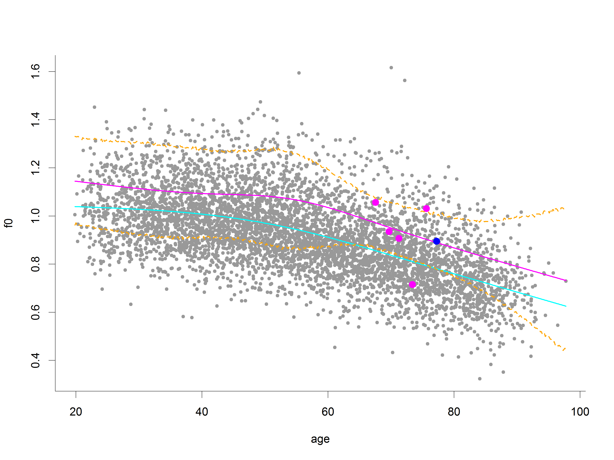
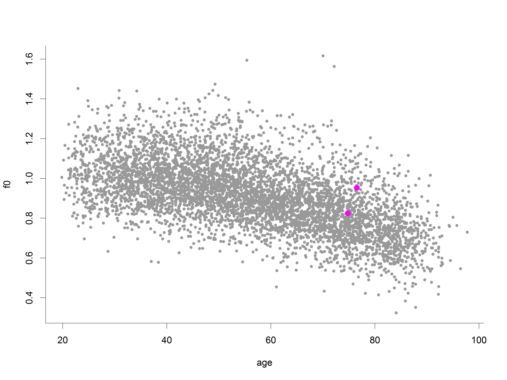
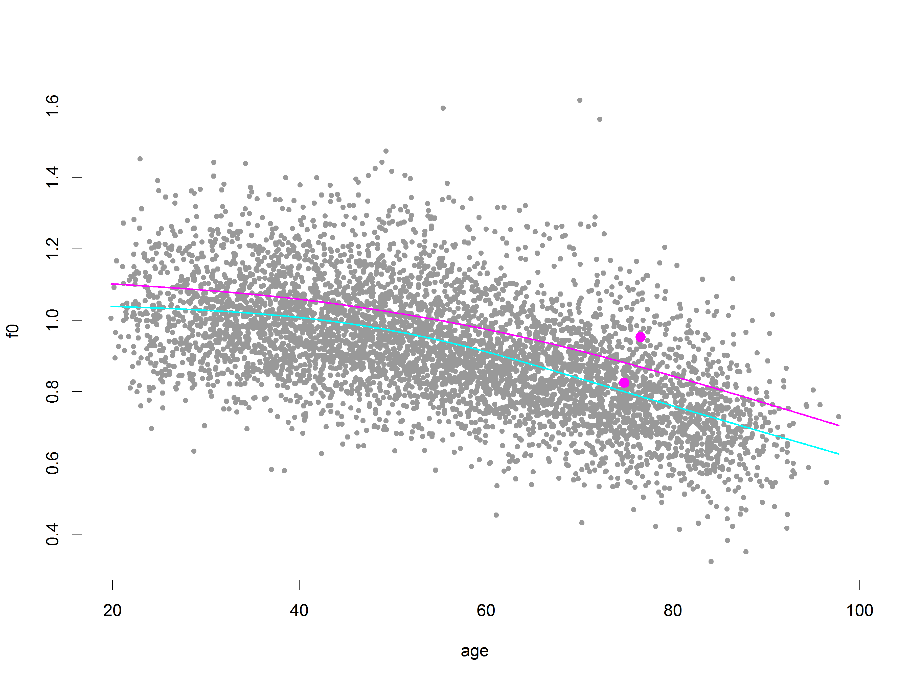

<!-- To compile: -->
<!-- require(slidify) -->
<!-- slidify("BiosDayDeakin2014.rmd") -->
<!-- Post creation need to edit html to adjust height and width. -->

## Prediction of bone mineral density trajectories
### Functional data analytic approach
#### Steve Lane
##### stephen.lane 'at' barwonhealth.org.au
##### Barwon Health Biostatistics Unit
<!-- Date (if required): -->
<!-- ##### `r format(Sys.time(), "%A %B %d, %Y")` -->

<aside class="notes">

- Kept here as a placeholder

</aside>

---

<section>

## What is functional data analysis?

<!-- Include R logo? -->

---

### Two scenarios

- But one theme!
- Object of analysis is a curve observed on a:
  - dense grid, over the full domain of interest
  - sparse grid, within a subset of the domain of interest

---

### Fine grid, full measurement domain
<!-- Example from my regression tree paper? Cool interactive graph! -->
- [Handwriting example](http://www.psych.mcgill.ca/misc/fda/)

---

### Sparse grid, subset of measurement domain

<iframe src="f0.html" width=1280 height=720></iframe>

---

### (Some) mathematical/statistical details
#### (for the sparse case)
<!-- Slide (or a couple) to include the nuts and bolts -->
<!-- Refs as footers, as it doesn't work with pandoc yet. -->

- Assume that $Y_{i}(t_{ij})$ are BMD observations
- $E[X(t)] = \mu(t)$
- $\text{cov}[X(t), X(s)] = G(t, s)$
- The functional model can be written as
$$
	\begin{aligned}
	Y_{i}(t) & = X_{i}(t) + \epsilon_{i}(t)
	\end{aligned}
$$

---

### Mixed models representation

- The subject specific curves are considered as deviations from the mean
$$
	\begin{aligned}
	X_{i}(t) & = \mu(t) + \eta_{i}(t)
	\end{aligned}
$$
  with $\eta_{i}(t)$ modelled as a combination of basis functions, to give
$$
	\begin{aligned}
	Y_{i}(t_{ij}) & = \mu(t_{ij}) + \sum_{k=1}^{K}\xi_{ik}\psi_{k}(t_{ij}) +
	\epsilon_{i}(t_{ij})
	\end{aligned}
$$

---

### Estimation of parameters

- We treat the basis functions $\psi_{k}(t)$ as fixed
$$
	\begin{aligned}
	G(s, t) & = \sum_{k=1}^{\infty}\lambda_{k}\psi_{k}(s)\psi_{k}(t) \\
	X(t) - \mu(t) & = \sum_{k=1}^{\infty}\xi_{k}\psi_{k}(t) \\
	\end{aligned}
$$
- Two main approaches:
  - Use the BLUP
  - MCMC

</section>

---

<section>

## Application to a longitudinal cohort study

---

### Geelong Osteoporosis Study (GOS)

<!-- Slides (perhaps multiple) of GOS description -->

- Prospective cohort study
- Originally designed to address
  - Osteoporosis prevalence
  - Age-related BMD change
  - Osteoporosis and fracture risk
- Also collects
  - Depressive and anxiety disorders (questionnaires and SCIDs)
  - Diet and alcohol

---

### GOS Cohort

- Age stratified
- Barwon statistical division/electoral roll
- At baseline
  - 1494 women (1993-1997)
  - 1540 men (2001-2006)

---

### The importance of BMD
<!-- This is a bit of an 'aside' slide -->
- BMD is used to define osteoporosis
- Much like BMI, this is seemingly arbitrary
  - Osteoporosis: BMD $<2.5$ sd below the reference mean (!)
- Predicting individual trajectories hopefully leads to improved planning and
  patient management

---

### Can we use FDA to fit and then predict future BMD trajectories?

<!-- Details of process, cross-validation study, metrics used to see if it works -->
<!-- -->
<!-- This could be better as a series of figures, highlighting one trajectory -->
<!-- and looking at where it fits in. -->
- Accuracy of fitted curves show via simulated data
  - We don't have the true curves (like all applied work!)
- Accuracy of future values (predictions/forecasts)
  - We do have these
  - But they're measured with error as well!

---

### Individual example
<!-- 74 y.o. seen at baseline and 2 year fu -->

---

### Individual example
<!-- 74 y.o. seen at baseline and 2 year fu -->

---

### Individual example
<!-- 74 y.o. seen at baseline and 2 year fu, not seen again until the 4th wave -->
<!-- Look at the predicted curve - how can we measure how close we are? -->

---

### Cross-validation study

1. Withhold the last observation from a subset (test set) of individuals
2. Fit to the remaining data
3. Predict the distribution (MCMC) for future observations of the test set
   individuals
4. Rinse and repeat

- Data summaries:
  - Coverage of 95% posterior intervals
  - Widths of 95% PIs for forecast lengths $h \in (0, H]$

---

### Results (5 xvals)

- Coverage
  - 95.4%
- By number of future waves:
  - 97.0%, 93.9%, 100%
- 10% loss 'alert'
  - If predicted to have greater than 10% loss of BMD
  - Needs finessing
  - 9.9%

---

### Width of forecast intervals

---

### Is this information useful?

<!-- Probably more useful is to give intervals and probabilities of events -->
<!-- happening, e.g. the probability of losing more than 5% BMD in a given -->
<!-- period. Can get this using posterior simulations. -->

- Patients with osteopenia are advised to have a repeat bone scan every 1-2
  years
- Management could be helped by
  - Prediction intervals, say 80% and 95%
  - Probabilities of crossing a threshold, e.g. loss of more than 5% BMD over
    the next 2 years

---

### Example 1

---

### Example 1

---

### Example 1

---

### Example 2

---

### Example 2

---

### Example 2

</section>

---

<section>

## Where to from here?

---

### What is the impact of an acute event?

<!-- ICU stay, are these any different? Give what I'm thinking, then perhaps -->
<!-- note the landmarking work, and the Stat. Med. paper just out -->

- There's some evidence to suggest that an ICU stay has an impact on bone loss
  - How can we investigate this?
- Prospectively?
  - No pre-ICU BMD baseline (best is 2-4 weeks following, if they come in)
- GOS + ICU linkage
  - Regular measurements before and (hopefully) after
- But:
  - Different ages when the ICU event occurs
  - Different stages in terms of the GOS measurement schedule

---

### Effect of acute events: possible approach
<!-- Definitely early work -->
- Take the prediction/forecasting approach outlined previously:

1. Withhold all BMD measurements post-ICU event

2. Fit to the remaining data

3. Predict the distribution (MCMC) for future observations of the ICU

- What to do with this distribution?
  - Probability of the known post-ICU measurement given the pre-ICU BMD
    trajectory

---

### Are those with an acute event just 'different'?

- Is it just that those with an event have a different trajectory fullstop?
- Unsupervised learning on trajectories and check labels?

</section>
