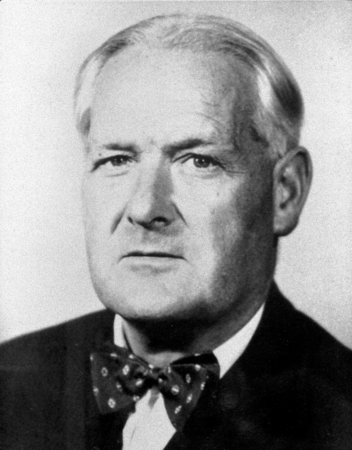

## What is epidemiology?

- [WHO](http://www.who.int/topics/epidemiology/en/)

> Epidemiology is the study of the distribution and determinants of
> health-related states or events (including disease), and the application of
> this study to the control of diseases and other health
> problems.

- [BMJ](http://www.bmj.com/about-bmj/resources-readers/publications/epidemiology-uninitiated/1-what-epidemiology)

> Epidemiology is the study of how often diseases occur in different groups of
> people and why. Epidemiological information is used to plan and evaluate
> strategies to prevent illness and as a guide to the management of patients in
> whom disease has already developed.

- 'The study of what is upon the people' (Greek)

--- &twocol

## A brief swim back through time

*** =left

### John Snow

*** =right

### &hellip; not Jon Snow

--- &twocol

## Modern epidemiologists

*** =left

<figure><figcaption>"<a
href="http://commons.wikimedia.org/wiki/File:Austin_Bradford_Hill.jpg#/media/File:Austin_Bradford_Hill.jpg">Sir
Austin
Bradford Hill</a>" by Unknown - <a
rel="nofollow" class="external autonumber"
href="http://wellcomeimages.org/indexplus/image/L0027006.html">[1]</a>. Licensed
under <a href="http://creativecommons.org/licenses/by/4.0" title="Creative
Commons Attribution 4.0">CC BY 4.0</a> via <a
href="//commons.wikimedia.org/wiki/">Wikimedia Commons</a>.</figcaption></figure>

*** =right

<figure><figcaption>"<a
href="http://commons.wikimedia.org/wiki/File:Richard_Doll.jpg#/media/File:Richard_Doll.jpg">Sir
Richard
Doll</a>" by <a href="//commons.wikimedia.org/wiki/User:CJ_DUB" title="User:CJ
DUB">CJ DUB</a> - Own work. Licensed
under <a href="http://creativecommons.org/licenses/by-sa/2.0/ca/deed.en"
title="Creative Commons Attribution-Share Alike 2.0 ca">CC BY-SA 2.0 ca</a> via
<a href="//commons.wikimedia.org/wiki/">Wikimedia
Commons</a>.</figcaption></figure>

--- .dark .segue

## Measuring occurrence

---

## What do we mean by occurrence?

<!-- We often want to know what causes disease, so we need to measure how often -->
<!-- it occurs. -->

- Prevalence
  - How many persons *have* the disease at a given point in time
- Incidence
  - How many persons *get* the disease within a certain time period

--- {tpl: tabs}

## HIV

*** {class: active, id: Prevalence}

<iframe src="http://bit.ly/1FQ7B6a"></iframe>

*** {id: Incidence-proportion}

<iframe src="http://bit.ly/1G1TvnE"></iframe>

---

## Measuring prevalence

- Prevalence is often not the main goal
  - Why? It focuses on the *existing* disease state
- Prevalence is affected both by incidence rate *and* duration of disease
- But: it can be easy to measure
  1. Take a sample from your population
  2. Ask/test if they have the disease of interest
  3. Calculate prevalence as the number of diseased in the sample

---

## Measuring incidence

- Incidence is often the major focus
  - Why? It focuses on the *change* in disease state (i.e. new events occurring)
- But: it is harder to measure
  1. We need to sample an at risk population
  2. We need to record the period in which they are at risk
  3. We need to record who has disease onset (and when)
  4. Calculate incidence rate as 
  $$
  \begin{aligned}
    \text{i.r.} & = \frac{\text{number of disease onsets}}{\sum_{\text{persons}}\text{time at risk}}
  \end{aligned}
  $$

---

## Measuring incidence (contd.)

- Time is key in incidence
  - So different *times* can give the same incidence
- Example: 1 case per 100 years. This could be found by either
  - Following 100 people for an average of 1 year, and observing 1 case; or
  - Following 2 people for 50 years, and observing 1 case.
- Incidences are not proportions, so don't confuse them with risks!

--- .dark .segue

## Types of studies

<!-- We know what we want to calculate, but how do we get data to calculate it? -->

--- {tpl: tabs}

## Observational studies

*** {class: active, id: Cross-sectional}

- All individuals in a population or representative sample are included at the
  time of measurement
  - E.g. a questionnaire/survey
- Can establish prevalence, but not incidence

*** {id: Cohort}

- Standard design
- Take a sample from the exposed/unexposed cohort
  - Follow the individuals and record the event and time of onset of the disease
- Often the study design starts with a single cohort
  - Exposure is then ascertained based on subgroups of the cohort
  - These are often identified through lists, e.g. AEC

*** {id: Case-control}

- Hypothetical starting point is the cohort study that would be conducted
- Identify cases and their exposure
  - As in a cohort study
- Sample a *control* group of subjects from this hypothetical population
  - **Note:** this sampling means we cannot identify prevalence from a
    case-control study
  - We also need to sample independently of the exposure

--- {tpl: tabs}

## Experimental studies

*** {class: active, id: General}

- Generally refers to studies in which the investigator manipulates some
  *exposure*
- That is, exposure is under the control of the investigator

*** {id: Classes}

- Clinical trials
  - Subjects already with the disease (i.e. clinical)
- Field trials
  - Often preventive trials, subjects are general population members
  - Exposure assigned to individuals
- Community trials
  - Again, preventive trials, general population
  - Exposure assigned to communities

--- .dark .segue

## Measures of association

--- {tpl: tabs}

## Overview

*** {class: active, id: Overview}

- As already alluded we're often interested in risk factors for outcomes
- Who gets disease?
- Who dies from disease?
- I.e. the effect on incidence
- Information from, e.g., the previous study types allow us to estimate these
  associations

*** {id: Broad-classes}

- Relative measures
  - Are ratios of occurrences
  - Can be thought of as measuring the *strength* of association between risk
    factors
- Absolute measures
  - Are differences in occurrences
  - Can be thought of as measuring the *impact* of association with risk factors
  - **Note:** We need prevalence, so case-control designs are out

---

## Definitions

- Suppose we have two cohorts: exposed and unexposed
  - There are $N_{1}$ persons in the exposed cohort,
  - $N_{0}$ persons in the unexposed cohort, and
  - The cohorts are followed (the at-risk time is) for total time $T_{1}$ and
    $T_{0}$ respectively
- During this follow up, there are
  - $Y_{1}$ cases of disease recorded in the exposed group, and
  - $Y_{0}$ in the unexposed group

--- &twocol

## Relative measures

*** =left

- Risk ratio
  - Ratio of incidence proportions
  \[
  \frac{Y_{1}/N_{1}}{Y_{0}/N_{0}}
  \]
  - Need a fixed time interval
- Rate ratio
  - Ratio of incidence rates
  \[
  \frac{Y_{1}/T_{1}}{Y_{0}/T_{0}}
  \]

*** =right

- Odds ratio
  - <a href="#" rel="tooltip" data-original-title="This is the commonly seen
  product of diagonal terms in a 2x2 cross-classification table.">Ratio</a> of
  incidence odds
  \[
  \begin{align}
  & \frac{Y_{1}/N_{1}}{(N_{1} - Y_{1})/N_{1}} \div \frac{Y_{0}/N_{0}}{(N_{0} - Y_{0})/N_{0}} \\
  = & \frac{Y_{1}}{N_{1} - Y_{1}} \div \frac{Y_{0}}{N_{0} - Y_{0}}
  \end{align}
  \]
- Hazard ratio (advanced &#12483;)
  - Basically a rate ratio
  - Technically: relates to instantaneous risk

---

## Absolute measures

- Risk difference
  - Difference in incidence proportions
  \[
  \frac{Y_{1}}{N_{1}} - \frac{Y_{0}}{N_{0}}
  \]
  - Need a fixed time interval
- Rate difference
  - Difference in incidence rates
  \[
  \frac{Y_{1}}{T_{1}} - \frac{Y_{0}}{T_{0}}
  \]

--- {tpl: tabs}

## The mighty odds ratio&hellip;

*** {class: active, id: Complete-population}

### &hellip; or why prevalence matters

- Suppose I had information on the complete at-risk population

|  | Diseased | Disease-free | Total |
|---|---|---|---|
| Exposed | 10 | 875 | 885 |
| Unexposed | 5 | 5225 | 5230 |

- The risk ratio would be $10/885 \div 5/5230 = 11.82$
  - A very strong association

*** {id: Sampled-population}

### &hellip; or why prevalence matters

- Now, what if found all the diseased (<a href="#" rel="tooltip"
  data-original-title="For example, through a disease registry.">somehow</a>)
  and sampled $1\%$ of the disease-free population? Our table may look something
  like this:

|  | Diseased | Disease-free | Total |
|---|---|---|---|
| Exposed | 10 | 9 | 17 |
| Unexposed | 5 | 52 | 57 |

- If we naively calculated the risk ratio, it would be $6.71$
  - Almost half as big as what it should be!
- **But!** The odds ratio is $(10/9) \div (5/52) = 11.56 \approx 11.82$
- For *rare* diseases the odds ratio $\approx$ risk ratio

--- .dark .segue

## Infectious disease epidemiology

---

## Possible <a href="#" rel="tooltip" data-original-title="Adapted from Rothman et al. (2008)">states</a>

---

## The exposure state

- Who is at risk of exposure?
- Can often be clear
  - Hendra: vets (and others) working with infected horses
  - Ebola: contact with infected people
  - HIV: unprotected sex, sex with sex workers
- **But:** can be difficult to *treat*
  - E.g. don't work with horses in Queensland
  - Don't go to nations with ebola
  - Use a condom
- But may also be unclear
  - We generally can't tell the infectious state of the mosquito that bit us
- Identifying these *at-risk* groups means we can identify strategies to reduce
  risk of exposure
  - Public health, broad scale

--- {tpl: tabs}

## The post-exposure state

*** {class: active, id: Exposure-General}

- Who is at risk of infection?
  - Clearly, need to be exposed first!
- After exposure, infection could be due to:
  - Dose-related factors (how much exposure)
  - Infectivity factors (how well the agent establishes itself)
  - Host-related factors (individual factors, e.g. immunisation)

*** {id: Exposure-Article}

<iframe src="http://www.nejm.org/doi/full/10.1056/NEJMoa1108524#t=articleTop"></iframe>

*** {id: Exposure-Discussion}

- Who is at risk?
  - Partners of HIV-positive individuals
- What is the aim?
  - Reduce mother-to-child transmission of HIV
- What is the best way of doing this?
  - Condom usage
  - **But:** of course condom usage kind of (mostly) stops pregnacy
    occurring&hellip;
- What now?
  - PrEP: Pre-exposure prophylaxis
  - For HIV-negative people, this greatly reduces their risk of becoming
    infected

--- {tpl: tabs}

## The post-infection state

*** {class: active, id: Infection-General}

- Who is at risk of disease?
  - Clearly, those who have been infected!
- Once infected, progression lengths become important
  - Long progression times imply long cohort studies to determine risk of
    disease
- It is also often difficult to identify those with infections
  - E.g. latent TB or HPV often do not have symptoms
  - Take risk profile into account

*** {id: Infection-Article}

<iframe src="http://www.nejm.org/doi/full/10.1056/NEJMoa1104875#t=articleTop"></iframe>

*** {id: Infection-Discussion}

- What is the aim?
  - Show that a shorter course of antibiotics is just as good as a longer course
    in preventing progression to TB disease
- Clearly this is difficult
  - Identifying subjects/low incidence
  - Long follow-up
  - Even in the at-risk group, progression is estimated at only 5% within 2
    years

--- .dark .segue

## Analysis of epidemiological data

---

## After measurement, where to?

- Data editing/cleaning
- Data description/summarising
- Handling of imbalance and confounding
  - We're often interested in a certain exposure
  - But what if more males are exposed (relatively) than unexposed?
  - We need to adjust for this otherwise our estimates of relative effect due to
    exposure will be biased

---

## Common methods of analysis

- For control of confounders/bias
  - Identify possible strategies for containment
- Stratification
  - Compare groups A and B in strata X and Y
- Regression
  - Compare groups A and B after adjusting for X and Y
- Matching
  - Compare groups A and B after matching on X and Y

--- &twocoluser wid1:60% wid2:36%

## Stratification

*** =left

- Common for age and sex
  - Break age into 10 year groups
- Calculate the <a rel="popover"
  data-content="For example, the odds ratio of the outcome comparing two drugs."
  data-original-title="Statistic of interest" id='example'>statistic</a> of
  interest in each each combination of strata
  - {20-29 y.o. males, 20-29 y.o. females, 30-29 y.o. males, etc.}
- Combine them in a 'suitable' way
  - E.g. Mantel-Haenszel gives weight to strata with larger sample sizes
- Good first exploratory step
- Acts as a check for (multivariable) regression

*** =right

### Problems

- Defining suitable strata
  - Particularly with continuous variables
- Sparsity in strata
  - E.g. not many 90+ y.o. males

---

## Regression

- Simultaneous adjustment for all confounders/covariates
- Present the full model
  - Not just the effect of interest
- Use the literature to support:
  - Variable specification
  - Model specification

--- &twocol

## Regression (cont'd)

*** =left

### Variable specification

- Should **not** be determined by 'univariate' models and p-cutoffs
- Supported by in-depth literature review
- Include irrespective of 'statistical significance' at traditional cutoffs
  - This is arbitrary and leads to biased estimates
- 'Grouped' procedures work well

*** =right

### Model specification

- Specification to meet the outcome:
  - Logistic regression for binary (Yes/No, Dead/Alive) outcomes
  - Poisson regression for counts
  - Cox proportional hazard models for time to event outcomes
  - Multilevel/random effect models for clustered data

--- {tpl: tabs}

## Matching

*** {class: active, id: Matching}

- 'Balance' potential confounders
- Blunt instrument
- With many confounders it will obviously be difficult
  - Some 'relaxation' may be required
  - E.g. age +/- 10 years, rather than 5 years
- Specialised methods of analysis then required
  - E.g. conditional logistic regression

*** {class: class, id: Propensities}

- More sophisticated way of providing balance
- Model the 'propensity' to receive treatment/exposure A vs. B
- For analysis, can then use any of the previous
  - Stratification: stratify on the propensity score
  - Regression: Use the propensity score as a weight or as a covariate
  - Matching: match on the propensity score

---

## References

- Rothman, K. J., Greenland, S., & Lash, T. L. (2008). Modern Epidemiology
  (Third Edit.). Wolters Kluwer Health/Lippincott Williams & Wilkins.

--- .segue .dark

## Thank You
