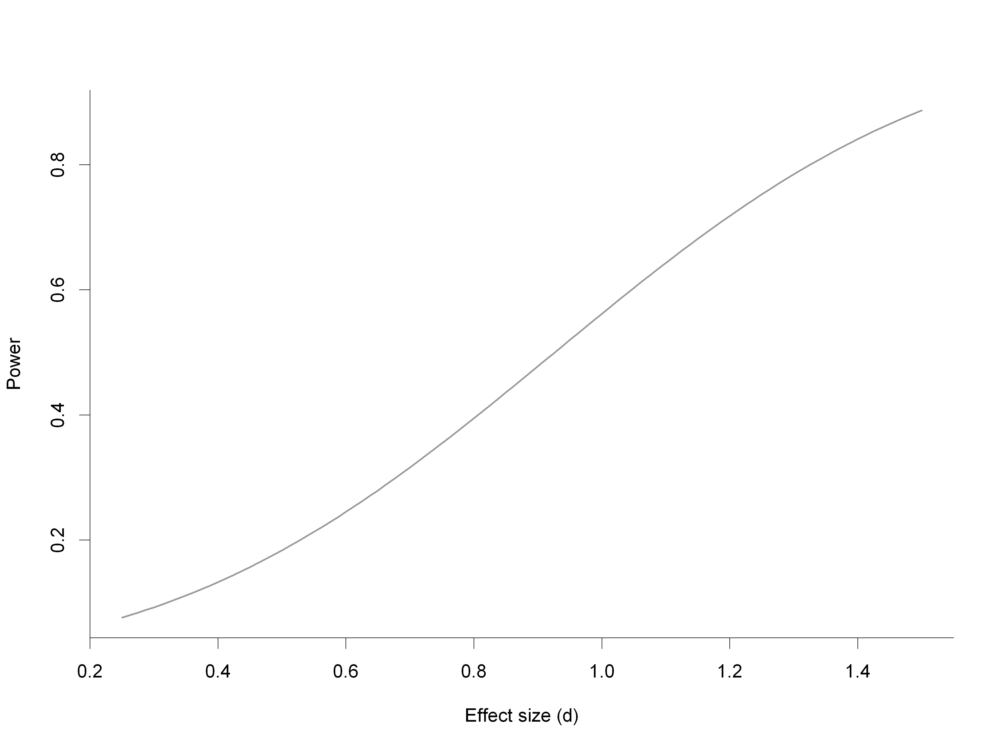
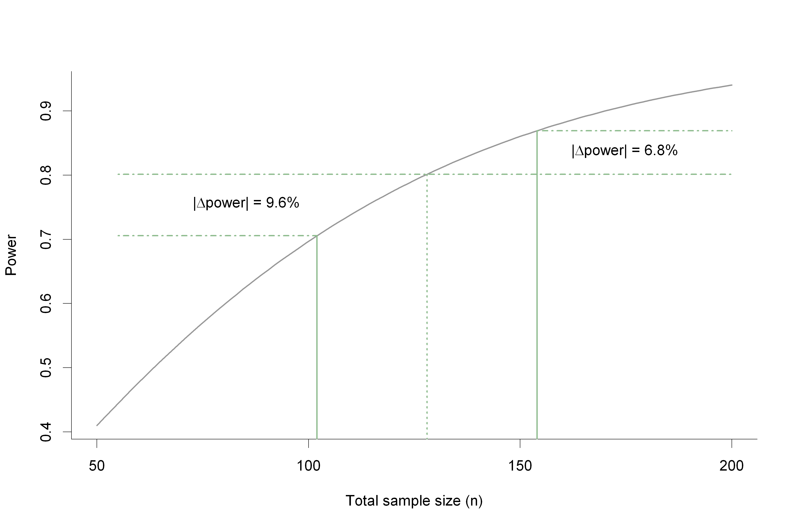
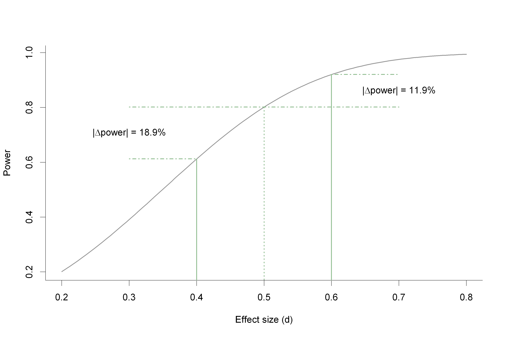
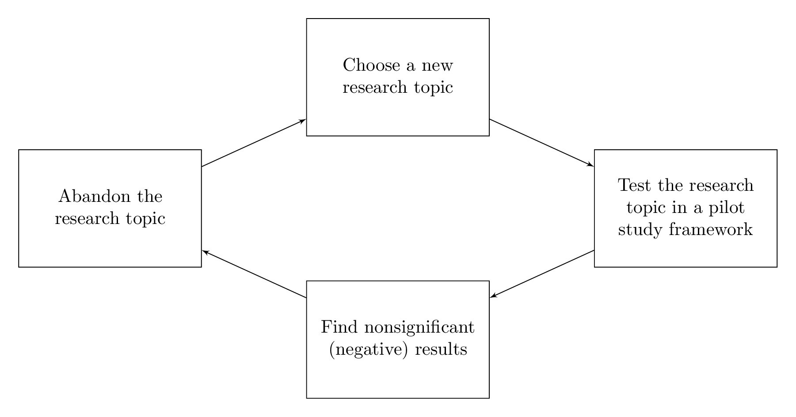
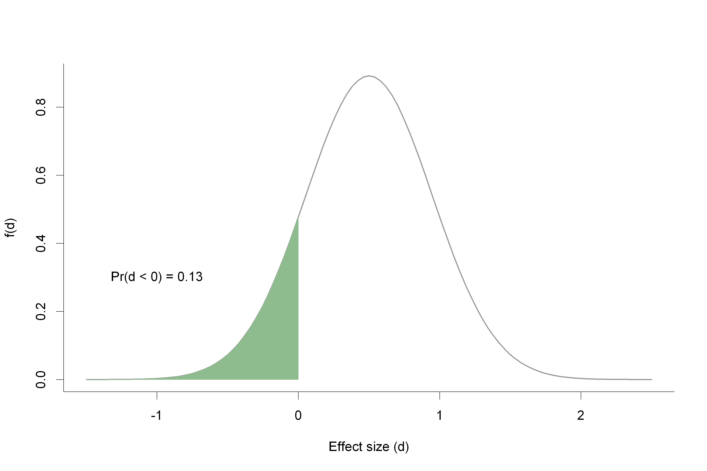
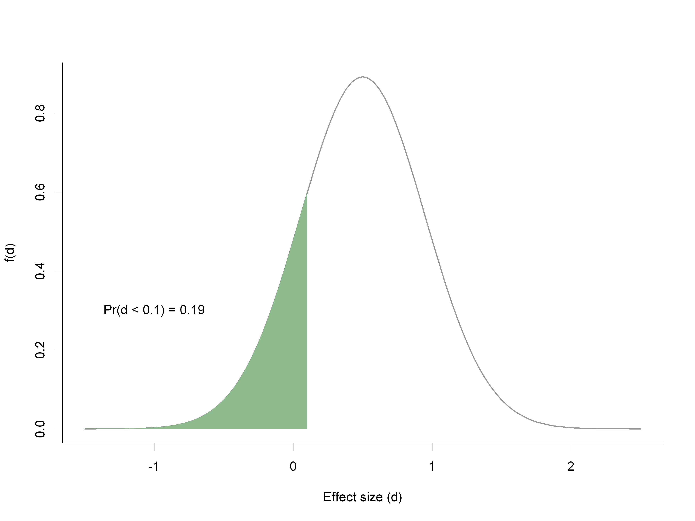
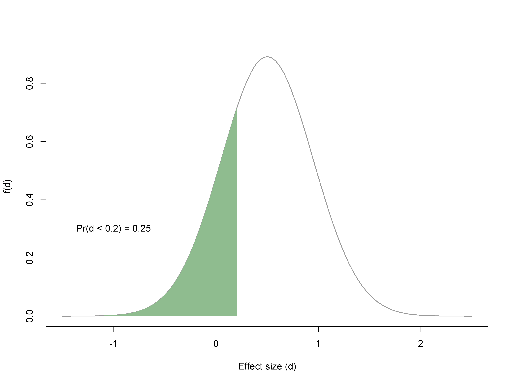

<!-- When compiling edit html afterwards to change slide transitions on images, -->
<!-- and to width and height changes. -->
# Pilot Studies
## (What they are, and what they aren't)
### Steve Lane
##### stephen.lane 'at' barwonhealth.org.au
##### Barwon Health Biostatistics Unit

<aside class="notes">

- This talk was motivated by a 'robust' discussion in RRC
- Most research quantitative, yet skills can be lacking
- Something that is generally misunderstood, primarily due to a lack of
  knowledge surrounding power/sample size issues.

</aside>

---

### tl;dr

-   Pilot (feasibility, proof of concept) studies are:

    -   Studies designed to test the feasibility of the methods and
        procedures to be used in the larger study

-   Pilot studies are not:

    -   Studies for which available funding limits the number of
        participants

    -   Studies that test hypotheses

    -   Studies that estimate differences between groups (effect sizes)
        for use in sample size calculations

<aside class="notes">

- This talk will have a statistical focus

</aside>

---

<section>

## Regulatory statements

---

### Note for guidance on GCP (CPMP/ICH/135/95, TGA)

-   Clinical trials should be scientifically sound, and described in a
    clear, detailed protocol

    -   Item 2.5, $\S$2, `The principles of ICH GCP'

<aside class="notes">
- ICH: International Conference on Harmonisation of Technical Requirements for
Registration of Pharmaceuticals for Human Use
</aside>

---

### General considerations for clinical trials (ICH E8)

-   Clinical trials should be designed, conducted and analysed according
    to sound scientific principles to achieve their objectives; and
    should be reported appropriately.

    -   $\S$2.2, `Scientific approach in design and analysis'

<aside class="notes">
- If the objective is to test a hypothesis (e.g. difference in means), then
there should exist:
	- Sufficient power
	- Correct endpoint
	- Correct statistical test
</aside>

---

### Australian code for the responsible conduct of research

-   Researchers must foster and maintain a research environment of
    intellectual honesty and integrity, and scholarly and scientific
    rigour. Researchers must:

    -   $\cdots$

    -   adopt methods appropriate for achieving the aims of each
        research proposal

    -   $\cdots$

        -   $\S$1.6, `Maintain high standards of responsible research'

<aside class="notes">
- 'methods': statistical methods are a part of this
</aside>

---

### National statement on ethical conduct in human research ($\S$3.3.3)

-   Researchers should show that:

    -   the research is directed to answering a specific question or
        questions;

    -   there is a scientifically valid hypothesis being tested that
        offers a realistic possibility that the interventions being
        studied will be at least as beneficial overall as standard
        treatment, taking into account effectiveness, burdens, costs and
        risks;

    -   the size and profile of the sample to be recruited is adequate
        to answer the research question; and

    -   the research meets the relevant requirements of the CPMP/ICH
        Note for Guidance on Good Clinical Practice (CPMP/ICH-135/95),
        ISO 14155 Clinical Investigation of Medical Devices, and the
        TGA.

<aside class="notes">
- Size and profile of the sample:
  - size means power statement or a discussion on probable standard errors
  - profile means who you're recruiting (inclusion/exclusion)
	- what is the chance of getting good balance in a 'pilot' study with say, 10
	in each arm?
- Why do we randomise? One of the keys: Balance! Both in observed and unobserved
confounders.
</aside>

---

### Institution responsibilities

-   It is important that institutions provide induction, formal training
    and continuing education for all research staff, including research
    trainees. Training should cover research methods, ethics,
    confidentiality, data storage and records retention, as well as
    regulation and governance.

    -   $\S$1.3, `Train staff', Australian code

-   Institutions must see that any human research they conduct or for
    which they are responsible is: designed and conducted in accordance
    with the Australian code for the responsible conduct of research

    -   $\S$5.5.1(a), `Research governance', National statement

<aside class="notes">
- So basically any study must be 'scientifically' sound (whatever that means!)
  - Biology and hypothese must make sense
  - Statistically: we must have measureable/testable hypothese/aims
</aside>

</section>

---

<section>

## Pilot studies: what they aren't

---

### Commonly used rationales

-   I can only get a small number of participants

-   I did a similar study a couple of years ago and it got published

-   [Author name] published a study with only 10
    participants, we're going to get 20!

-   It's only a student project

-   It's low risk

-   My funding doesn't cover extending timelines/multi-centre studies

-   My supervisor told me to run it as a pilot

 Thabane, L. et al. (2010). "A tutorial on pilot studies: the what, why and how." <i>BMC
medical research methodology 10</i>, p.1.

<aside class="notes">
- To counter each of these:
  - Will we learn anything?
  - Peer review is not infallible
  - As above, and the sample size is still small (double nothing is nothing)!
  - So student's should be held to lesser standards?
	- Design projects that are suitable for students
  - Still a waste of participant's goodwill/time/money
  - Then design a study your funding will cover
  - Difficult: supervisor in a position of power and thus needs to be educated
</aside>

---

### A common theme

-   Sample sizes are too small

    --- and ---

    testing of hypotheses is proposed in the study protocol

-   Resulting in a severe lack of power (in most cases)

<aside class="notes">
- Can compare these to Type 'S' and Type 'M' errors (Gelman) for sign and
magnitude
</aside>

---

### Power example

-   Fixed $n = 20$ ($10$ per group), testing the difference between
    means

<aside class="notes">
- Context is obviously really important
- What this slide is howing is that to have a power of 0.8, with 10 in each
  group, the effect of the intervention would have to raise (lower) the outcome
  by 1.3 standard deviations
- It may be that in some areas an effect size of 1.3 is true
  - But not in many!
- E.g. IQ scores: mean 100, sd 15
  - We'd need to have an intervention that raised IQ by 20 for a sample size
  this small to have 0.8 power!
</aside>

---

### Power example (cont'd.)

-   Fixed $\delta = 0.5$, $n$ varies by $\pm20\%$

<aside class="notes">
- Asymmetric
- So now what? If we don't have reasonable power to test differences, what do we
  do?
  - What about estimating differences for the true study?
</aside>

---

### Sample size estimation

-   Pilot studies are often used to estimate the sample size for the
    full study

    -   This is incorrect if performed `blindly'

-   For a two-sample difference in means, the effect size $\delta$ is

    $$\begin{aligned}
          \delta & = \frac{\mu_{1} - \mu_{2}}{\sigma}
              \end{aligned}$$

    with the sample size (per group):

    $$\begin{aligned}
          n_{1} & = n_{2} = n \geq 2(z_{1-\alpha/2} + z_{1-\beta})^{2} \times \left(
            \frac{\sigma}{\mu_{1} - \mu_{2}} \right)^{2}
        \end{aligned}$$

---

### Sample size estimation (cont'd.)

-   The issue is that the effect size is itself unknown, and hence needs
    to be estimated; it has variance:

    $$\begin{aligned}
          \text{Var}(\hat{\delta}) & \approx \frac{2}{n}
        \end{aligned}$$

-   Example: $\hat{\delta} = 0.50$, $n_{1} = n_{2} = n = 10$ ;

    $$\begin{aligned}
          95\% \text{ CI } (\delta) & : (-0.39, 1.39)
        \end{aligned}$$

---

### Power and effect size

-   Fixed $n = 64$, $\delta$ varies by $\pm20\%$

<aside class="notes">
- So following from earlier, still asymmetric, but much more sensitive to
changes in effect size
- This figure is for moderate n
- So, thinking about these curves, and variation in effect sizes, you can
hopefully see why taking the 'naive' route is silly
</aside>

---

### The poorly productive pilot cycle

	

	Moore, C. G. et al. (2011). "Recommendations for planning pilot studies in
	clinical and translational research." <i>Clinical and translational
	science</i>, 4(5), p. 332-7.
	

---

### Errors in decision making

-   Continue to full study if the *point* estimate $d > 0$

<aside class="notes">
- Significant proportion of the curve below 0
</aside>

--- {data-transition: "none"}

### Errors in decision making

-   Continue to full study if the *point* estimate $d > 0.1$

---

### Errors in decision making

-   Continue to full study if the *point* estimate $d > 0.2$

---

### Errors in decision making (cont'd.)

-   This leads to bias in the expected effect size

    -   I.e. the expected effect size is larger than the true effect
        size

-   $\Rightarrow$ Sample sizes are smaller for the main study

</section>

---

<section>

## Pilot studies: what they are

---

### What they are

-   Studies designed to test the feasibility of the methods and
    procedures to be used in the larger study

    -   Recruitment rates

    -   Retention rates

    -   Compliance

    -   Assessment time

    -   Time to fill out forms

    -   Data issues

    -   Willingness to be randomised

	
 Thabane, L. et al. (2010). "A tutorial on pilot studies: the what, why and how." <i>BMC
		medical research methodology 10</i>, p. 1.

	

		Arain, M. et al. (2010). "What is a pilot or feasibility study? A review
	of current practice and editorial policy." <i>BMC medical research
	methodology</i>, 10, p. 67.
	

<aside class="notes">
- The obvious example here is a new questionnaire
  - How long does it take to answer?
  - Do the Qs 'work'?
  - Do participants answer in the way we expected?
  - We wouldn't use data from these tests for analysis, so what's the difference
	with an experiment?
- Compliance
  - Big issue with trials, especially with complex interventions
- Data issues
  - Do my CRFs collect the 'right' data?
</aside>

---

### What they are (cont'd.)

-   Part of a bigger research project

-   There should be clear decision criteria surrounding:

    -   When the project is abandoned

    -   What will be the key decision points for change

<aside class="notes">
- Key decision points
  - This is similar to how we declare an intervention 'successful' in an RCT (it
  is stated a priori in the protocol)
</aside>

---

### Sample size requirements of a pilot study

-   Sample size of a pilot study should not be neglected

-   It should be sufficient to estimate key *feasibility* parameters

    -   This can be done so that a margin of error is guaranteed:

    -   For example, to estimate a proportion to within $\pm 0.2$ with
        $95\%$ confidence, (at most) 24 participants would be required

</section>

---

<section>

## Alternatives/extensions of pilot studies

---

### Internal pilot studies

-   Advantage:

    -   Forms part of the main study

        (we can use the 'pilot' participants in the final analysis)

-   Disadvantage:

    -   Forms part of the main study

        (we can't make other adaptations)

---

### Restricted design

-   Only allows upwards revision of sample size

-   If $n_{0}$ denotes the original planned sample size and $\hat{n}$
    denotes the revised sample size from the internal pilot of $n_{1}$
    participants, then:

    $$\begin{aligned}
          n_{2} & = \max \left\{n_{0}, \hat{n}\right\} - n_{1}
        \end{aligned}$$

    denotes the extra participants required in the second stage

<aside class="notes">
- Sample size needs to be large enough so that variance/control rates are
estimated well
</aside>

---

### Issues with the restricted design

-   Blinding/masking

    -   E.g. a $t$-test requires calculation of the pooled variance:

        $$\begin{aligned}
                S^{2} & = \frac{(n_{11} - 1)S_{11}^{2} + (n_{12} - 1)S_{12}^{2}}{n_{11}
                  + n_{12} - 2}
              \end{aligned}$$

        where $n_{1i}$ and $S_{1i}$ are the sample size and sample
        standard deviation after the pilot stage in group $i$

    -   A DSMB is then needed to run the unblinded calculations

        -   Prefer a blinded assessment (no DSMB needed)

        -   Use a `lumped' variance

-   Effect on Type I error1

    -   Generally small for superiority trials

    -   Should demonstrate possible effects in the protocol

	

		1Occurs with any study involving interim analysis
	

<aside class="notes">
- Effect on Type I error for a documents
</aside>

---

### Trials with efficacy monitoring

-   Can include both IPS and efficacy/futility monitoring

-   Advantage:

    -   Sample size adjustment

    -   Early stopping (saving participants/resources)

-   Disadvantage:

    -   Complex

    -   DSMB required

	

		Proschan, M. A. et al. (2006). <i>Statistical Monitoring of Clinical
		Trials: A Unified Approach. Statistics for Biology and
		Health</i>. Springer.
	

---

### Trials with efficacy monitoring (cont'd.)

-   A multitude of possible designs

-   If including IPS, probably easiest to perform this before efficacy
    monitoring

-   E.g. plan IPS at $1/3n$, and efficacy monitoring at $1/2n, 3/4n$

    -   Initial sample size based on the interim monitoring schedule

    -   But, monitoring times and boundaries updated after sample size
        adjustment

---

### Final thoughts

-   Don't be naive!

    -   Don't use point estimates for decisions

    -   Don't base continuance decisions on effect sizes

-   Inform participants in the PICF of the pilot nature of the trial

    -   c.f. $\S$2.2 and 3.3 of the National Statement

-   Make decision points explicit in the trial protocol

    -   e.g. under what circumstances will the main trial not proceed

-   Publish!

    -   It is important to inform the scientific community about the
        feasibility of your trial

    -   Pre-publication and post-publication peer review

<aside class="notes">
- post-pub peer review (and pre) can be difficult because of timelines
</aside>

</section>
